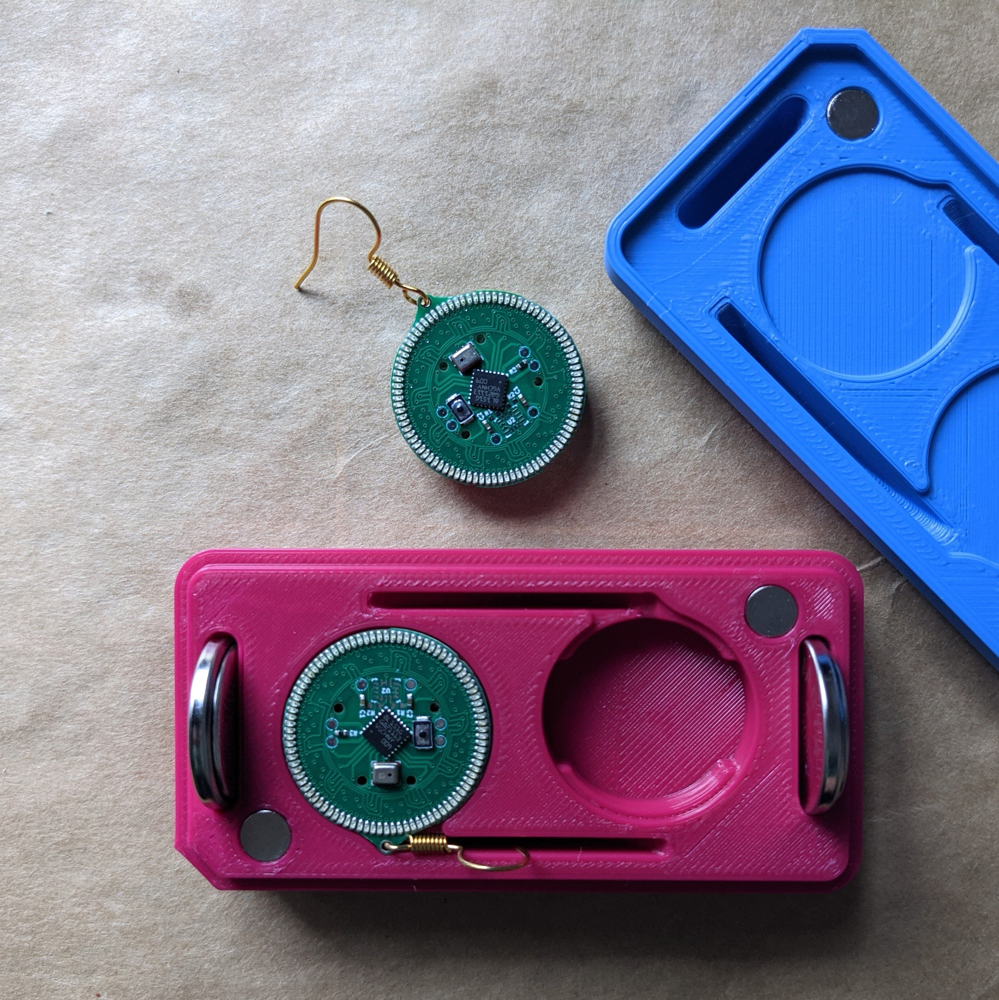

[Product gif, worn earrings]

# Halo-90
A distinct ring of light, an etherial glow, pattrens that ebb and flow with the music. Ninety tiny lights all controllable, powered by a common coin cell. A engrossing look with retro vibes and a modren touch.



The *Halo* product series, in which these earrings, Halo-90, are the first item is a fully open source electronic jewlery line. Designed foremeost with elegance and warability in mind. The 90 refers to the 90 individually controllable LEDs and pleanty of compute power for even doing complex patternes. 

This is the technical manual for anyone wanting to modify, hack, remix, or put thier own pattrens on the earrings. It goes into quite some detail about the construction, assembly, and firmware but should emcompass the required knowlege.

## Table of Contents

## Design
Design was always a core part from the very beignening, It *has* to look good, even more important that nit being funcitonal as it is a piece of jelery that people are going to wear. If it looks too complex or is even a little bit difficult to use, noone will want to waer it. Comfort was also a major goal as heavy earrings are painful to wear for extended time and no matter how stunning they are, its not worth the pain.

The desing also had to allow for subtle as well as the onstentations led pattrens that would be expected. Sensors were added on to make the pattrens personal or location dependent. Such as the muted audio based pattren that would befit a quiet resturaunt transforms into the flashy wide pattren at a concert.

### Hardware
The electronics are kept minimal for cost reduction and manufacturing simplicity with pads and routing done for all, but for exampel the IMU and its pullup resistors not mounted as there is no firmware suppourt for that and yields a lower cost variant.

#### LEDs
There are 90 LEDs that make up the ring, All are regular `0402` red diodes. All the cathodes (K/-) face towards the center of the board, and are placed at 4° intervals. The LEDS are charlieplexed with ten lines providing inidivdual control. They are run at as high a current as he battery's internal resistance and GPIO max current allows so no resistors are used. The red LEDs with thier 1.9V{?} forward voltage provide the abilibty to maximize battery useage.

We are using BL-HUB37A-AV-TRB as it is low cost and high avilibilty from multiple vendors across Chnia but any 0402 LED with a V_f below 2.7V, should yield equivilent battery life.

#### Microcontroller
STMicroelectonics's [STM8L151]() acts as the main controller of the earring. The low power microcroller has a wide range of prepherials, a long expected production life, and low cost and availibility in high quantities. Running at its max speed of 16Mhz it is able to to easily carliplex the 90 Leds at over 1kHz. The 12b ADC is used to readout the microphone ans has pleanty of (up to 32k) flash to store a assortment of pattrens or complex processed designs.

#### Battery
Linx Technologie's aptly named BAT-HLD-001 is a stamped die cut sheet metal battery holder that is as low pofile as possible. It is sized for a CR2032 lithium cell. THe metal acts as the anode while the pad on the PCB is the cathode. Battery life varies based on what threshold for brightness you are content with as over its life as the internal resistance of the battery increses and the voltage drops the current possible drops as does the brightness.

#### Microphone
The microphone selection was rather difficult due to a lack of specificaitons providided with amplified MEMS mirophones. Knowles P/N-xxxx was selected as it seemed reasonable and could be easilty tested with Adafruit's breakout board.

Using a built in amplified memes microphones decreses the number of componet placmenets and simplifies layout and verificiton at the expense of not having instumentation grade knowlege of your audio response.

#### Button
C&K [KXT3]() series provies ultra low profile minuture tactile switches and we chose `KXT311LHS` with a low actuaiton force of `100g`. It can be easily pressed with the edge of a nail, or a bit less confrotably with the back.

The button provies the functionality of changing the patterns by pressing, and putting into low power sleep mode by holding for 3s. COmplely avilible as a interupt to the microcontroller, so other uses can be implemented. 


#### IMU
LSD6M is a 6DOF IMU with a three axis accelometer and three axis gyroscope. It communicates over I2C and is connected to the hardware I2C periphiral in the microcontorller. It allows a fast data stream at a very low power. It also has additional low power modes as well as the ability to wake the main microcontrller over interupt with the routed interupt pin. 

#### Connectors
The only connectors the the board are six ⌀1mm copper circles that are exposed as contacts for spring pins. They are placed evenly across the board so it recives abalnced froce from the programmer or testing jig.
##### Power
THe bottom two circles are VCC and ground allowing power  to be applied for testing wor programming without the battery as well as for current sensing and power profiling.
##### Programing
The two pins on the right are RST and SWIM interface
##### UART
The laeft two pins are connectedto the UART interface. 

### Case
The case is designed in CAD and made to house two earrings (with or without batteries inserted) as well as two additional batteries. This allows to easily have arround 24 hours of runtime availible and organized. The case is two parts held togethwer with magents. All the edges are filleted and is comfortable to hold and fidget with. One corner is chamfered to make it easier to align the sections together in the correct orentation and the magnets are orented to resist trying to close it where the direction does not match and provides a very satisfying tactile click when they do. The cavities inisde hold all the parts securely so they dont rattle, and present them for display.

[opened filled case]

#### FDM Printed
THe first sets are made of 3D printed PLA plastic. The top and bottom have contrasting unique colours that identify the brand. They are printed with a 20% gyroid infill and at 200u layer height. The modles need to be scaled up to 100.2% to account for PLA shrinkage. 

#### Stone
A pebble or smooth seashell like finsih provides a feeling of luxury and the distincive material and stlye solifies the brand. 

##### Mould Master
Moulding masters were made out of the same 3D printed designs, printed at a 80u layer height, and then repeatedly filled primed and sanded from P400 to P3000 grit sandpaper on top of a glass plate to keep the straight faces square, this fills all the gaps and allows a very smooth finish. This is then buffed to a shine with nail buffer sponges.

[master]

##### Silicone Mould
A platinum cure shore A20 silicone rubber (Troll Factory TYP-1) is used to made a mould of the master. This has a accuracy of ~2u so is able to reproduce the surface finish. As the back is flat, a open faced mould is made. The part as well as walls are held in place with [meuseum wax] and mixing the exact ammount of silicone needed based on a CAD model means a high yield. After curing the mould box walls are cut off and the master is demoulded yeilding a silicone mould.

[mould]

#### Casting
The mould can now be case with many materials including other islicones, polyuretane rubbers and resins, and in our case, plaster. We are using high compressive strength Type-4 low expasninon dental plaster (Ernst Heinrichs). These plasters have a tryxothophic agent that allowsthem to flow better, meaning they mix up thinner and can reproduce finer detail. Applying asurfactant to the mould and mixing with distilled water and using a vibrating table yields low bubble castings. The back is roughly leveled off and let to cure. The part is then demoulded and the back is finsihed by hand with P320-P3000 grit sandpaper in several steps.

[casting]

After 24 hours the part has reached its final hardness and has dried out completely. It can then be processed further with magents and dye. 

**Testing, process optimization and verification is still in progress.**

#### Magents
The magents are 6mmx1mm N52 neodynium magents that are glued in usngin UHU Max repair Extreme. They are coated in Ni-Cu-Ni at around 12 microsn. The magents are a very close fit for alignment and are glued in to secure them and have a fixed orentation among all the parts made, so swapping tops or bottoms with other sets is possible. There are few adhesives that work well bonding two alreaddy hard to glue to materials together. Ceramics and nickel plating.

[magnet]

The magents are installed using a gluing jig. ONe for the top and one for the bottom. They have manets that are installed as well as a matching chamfer so the part cant be placed backwards or the incorrect part cannot be placed. The two jigs are colour coded as well. Adhesive is dispensed into the wells and the magent is dropped in autmatically orentating itself with the jig magnet. It can then be removed and set to harden.

## Firmware
The firmware is coded at the register level in C. The toolchain is bulit on open source tools and is 
### Modes
#### Dynamic
#### Sparkle
#### Halo
### LED control
### Compiling
Install make
Install SDCC

### Flashing
```bash
make flash
```

## Absolute Maximum Ratings
## Gaurenteed Ratings

## Manufacturing
### BOM
### PCB Assembly
### Physical Assembly
### Production Scaling

#### Electronics
All the componets aused are commonly availbile in high volumes mostly from multiple suppliers. THe microphone and battery holder are from single vendors but they hae proven track records and known supply chains. The microphone alternetive can be found 

The PCBs can be panelized and 
#### Case
The moulds can create secondary masters out of rsing and then used to make gang moulds allowing multiple castings in pararell. 

## Programer
Programer has a hole in he top for a pin to be able to push the button for testing.
THe programmer uses MilMax 09xxxxx spring pins on a PCB that mataches exactly wit

## Artwork
## Inventory and QC
## Packaging
## Safety
## Shipping
Lithium cells have special requirements for shipping 
## Certifications
## Liecence
## Attribution
- Make
- SDCC
- KiCad
- STM8L151G6 Header - Georg Icking-Konert
### Fonts
### Libraries

## Reccomended Reading
## ToDo