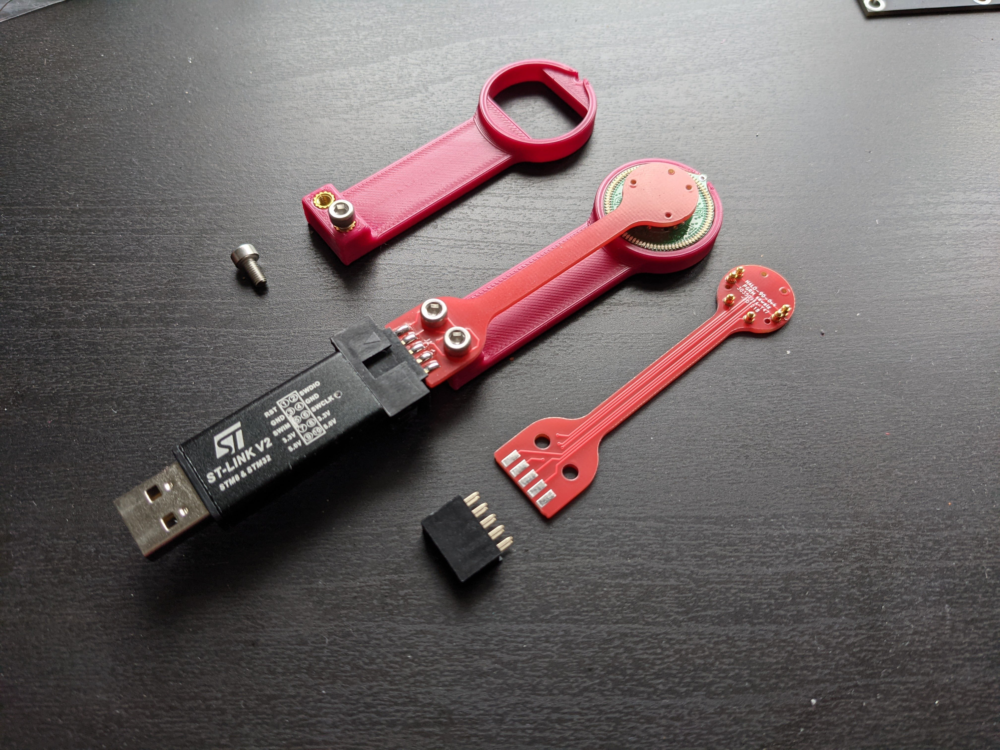

![wornDynamic]

# HALO-90
A distinct ring of light, an etherial glow, pattrens that ebb and flow with the music. Ninety tiny lights all controllable, powered by a common coin cell. A engrossing look with retro vibes and a modren touch.

![presentedCase]

The *HALO* product series, in which these earrings, Halo-90, are the first item is a fully open source electronic jewlery line. Designed foremeost with elegance and warability in mind. The 90 refers to the 90 individually controllable LEDs and pleanty of compute power for even doing complex patternes. 

This is the technical manual for anyone wanting to modify, hack, remix, or put thier own pattrens on the earrings. It goes into quite some detail about the construction, assembly, and firmware but should emcompass the required knowlege.

## Table of Contents

* [Design](#design)
  + [Hardware](#hardware)
    - [LEDs](#leds)
    - [Microcontroller](#microcontroller)
    - [Battery](#battery)
    - [Microphone](#microphone)
    - [Button](#button)
    - [IMU](#imu)
    - [Passives](#passives)
    - [Alignment Pins](#alignment-pins)
    - [Connectors](#connectors)
      * [Power](#power)
      * [Programing](#programing)
      * [UART](#uart)
  + [Case](#case)
    - [FDM Printed](#fdm-printed)
    - [Cast](#cast)
      * [Mould Master](#mould-master)
      * [Silicone Mould](#silicone-mould)
    - [Stone Casting](#stone-casting)
    - [Magents](#magents)
* [Firmware](#firmware)
  + [Modes](#modes)
    - [Dynamic](#dynamic)
    - [Sparkle](#sparkle)
    - [Halo](#halo)
    - [Power Managment](#power-managment)
  + [LED control](#led-control)
  + [Compiling](#compiling)
    - [Ubuntu/WSL](#ubuntu-wsl)
    - [Arch](#arch)
  + [Flashing](#flashing)
    - [Windows](#windows)
    - [Linux](#linux)
* [Absolute Maximum Ratings](#absolute-maximum-ratings)
* [Gaurenteed Ratings](#gaurenteed-ratings)
* [Manufacturing](#manufacturing)
  + [BOM](#bom)
  + [PCB](#pcb)
  + [PCB Assembly](#pcb-assembly)
    - [Assembly Detail Pictures](#assembly-detail-pictures)
    - [Potential Alternates](#potential-alternates)
  + [Physical Assembly](#physical-assembly)
  + [Production Scaling](#production-scaling)
    - [Electronics](#electronics)
    - [Case](#case-1)
* [Programer](#programer)
* [Artwork](#artwork)
* [Inventory and QC](#inventory-and-qc)
* [Packaging](#packaging)
* [Shipping](#shipping)
* [Safety](#safety)
* [Certifications](#certifications)
* [Liecence](#liecence)
* [Attribution](#attribution)
  + [Fonts](#fonts)
  + [Libraries](#libraries)
* [Reccomended Reading](#reccomended-reading)
* [ToDo](#todo)

## Design
Design was always a core part from the very beignening, It *has* to look good, even more important that nit being funcitonal as it is a piece of jelery that people are going to wear. If it looks too complex or is even a little bit difficult to use, noone will want to waer it. Comfort was also a major goal as heavy earrings are painful to wear for extended time and no matter how stunning they are, its not worth the pain.

![render]

The desing also had to allow for subtle as well as the onstentations led pattrens that would be expected. Sensors were added on to make the pattrens personal or location dependent. Such as the muted audio based pattren that would befit a quiet resturaunt transforms into the flashy wide pattren at a concert.

[patternGif]

### Hardware
The electronics are kept minimal for cost reduction and manufacturing simplicity with pads and routing done for all, but for exampel the IMU and its pullup resistors not mounted as there is no firmware suppourt for that and yields a lower cost variant.

[schematic]

#### LEDs
There are 90 LEDs that make up the ring, All are regular `0402` red diodes. All the cathodes (K/-) face towards the center of the board, and are placed at 4° intervals. The LEDS are charlieplexed with ten lines providing inidivdual control. They are run at as high a current as he battery's internal resistance and GPIO max current allows so no resistors are used. The red LEDs with thier 1.9V{?} forward voltage provide the abilibty to maximize battery useage.

We are using [BL-HUB37A-AV-TRB] as it is low cost and high avilibilty from multiple vendors across Chnia but any 0402 LED with a V<sub>f</sub> below 2.7V, should yield equivilent battery life.

![IMG-BL-HUB37A-AV-TRB]

#### Microcontroller
STMicroelectonics's [STM8L15xxx] acts as the main controller of the earring. The low power microcroller has a wide range of prepherials, a long expected production life, and low cost and availibility in high quantities. Running at its max speed of 16Mhz it is able to to easily carliplex the 90 Leds at over 1kHz. The 12b ADC is used to readout the microphone ans has pleanty of (up to 32k) flash to store a assortment of pattrens or complex processed designs.

![IMG-STM8L15xxx]

#### Battery
Linx Technologie's aptly named BAT-HLD-001 is a stamped die cut sheet metal battery holder that is as low pofile as possible. It is sized for a CR2032 lithium cell. THe metal acts as the anode while the pad on the PCB is the cathode. Battery life varies based on what threshold for brightness you are content with as over its life as the internal resistance of the battery increses and the voltage drops the current possible drops as does the brightness.

![IMG-BAT-HLD-001]

#### Microphone
The microphone selection was rather difficult due to a lack of specificaitons providided with amplified MEMS mirophones. Knowles P/N-xxxx was selected as it seemed reasonable and could be easilty tested with Adafruit's breakout board.

Using a built in amplified MEMS microphones decreses the number of componet placmenets and simplifies layout and verificiton at the expense of not having instumentation grade knowlege of your audio response.

![IMG-SPW2430HR5H-B]

#### Button
C&K [KXT3] series provies ultra low profile minuture tactile switches and we chose `KXT311LHS` with a low actuaiton force of `100g`. It can be easily pressed with the edge of a nail, or a bit less confrotably with the back.

The button provies the functionality of changing the patterns by pressing, and putting into low power sleep mode by holding for 3s. COmplely avilible as a interupt to the microcontroller, so other uses can be implemented. 

![IMG-KXT3]

#### IMU
[LSM6DSM] is a 6DOF IMU with a three axis accelometer and three axis gyroscope. It communicates over I2C and is connected to the hardware I2C periphiral in the microcontorller. It allows a fast data stream at a very low power. It also has additional low power modes as well as the ability to wake the main microcontrller over interupt with the routed interupt pin. 

![IMG-LSM6DSM]

#### Passives
There are three passives (five if the IMU is populated) that can be any tolerence. There are two 1 uF and 0.1 uF decoupling capacitors and one 10k pullup on the reset of the processor. The tow IMU pullups are 10k I2C pullups.

#### Alignment Pins
There are four tooling holes/alignment pins that can be used for addons. They are 1.152 mm (45.35 mil) in diameter and are placed 2.8mm and 5.5mm from the center. The earring is 24mm in diameter, weighs 5.5g and the top eyelte extends 2mm extra, yeilding a size of 24mm x 26mm.

![alignmentPins]

#### Connectors
The only connectors the the board are six ⌀1mm copper circles that are exposed as contacts for spring pins. They are placed evenly across the board so it recives abalnced froce from the programmer or testing jig.

![front]

##### Power
THe bottom two circles are VCC and ground allowing power  to be applied for testing wor programming without the battery as well as for current sensing and power profiling.
##### Programing
The two pins on the right are RST and SWIM interface. These are pins used for fashing and debugging the main chip.
##### UART
The laeft two pins are connectedto the UART interface. 

### Case
The case is designed in CAD and made to house two earrings (with or without batteries inserted) as well as two additional batteries. This allows to easily have arround 24 hours of runtime availible and organized. The case is two parts held togethwer with magents. All the edges are filleted and is comfortable to hold and fidget with. One corner is chamfered to make it easier to align the sections together in the correct orentation and the magnets are orented to resist trying to close it where the direction does not match and provides a very satisfying tactile click when they do. The cavities inisde hold all the parts securely so they dont rattle, and present them for display.

![caseRender]

#### FDM Printed
THe first sets are made of 3D printed PLA plastic. The top and bottom have contrasting unique colours that identify the brand. They are printed with a 20% gyroid infill and at 200u layer height. The modles need to be scaled up to 100.2% to account for PLA shrinkage. 

![caseFDM]

#### Cast
A pebble or smooth seashell like finsih provides a feeling of luxury and the distincive material and stlye solifies the brand. 

![caseBatch]

##### Mould Master
Moulding masters were made out of the same 3D printed designs, printed at a 80u layer height, and then repeatedly filled primed and sanded from P400 to P3000 grit sandpaper on top of a glass plate to keep the straight faces square, this fills all the gaps and allows a very smooth finish. This is then buffed to a shine with nail buffer sponges.

![caseMaster]

##### Silicone Mould
A platinum cure shore A20 silicone rubber (Troll Factory TYP-1) is used to made a mould of the master. This has a accuracy of ~2u so is able to reproduce the surface finish. As the back is flat, a open faced mould is made. The part as well as walls are held in place with [meuseum wax] and mixing the exact ammount of silicone needed based on a CAD model means a high yield. After curing the mould box walls are cut off and the master is demoulded yeilding a silicone mould.

![caseMould]

#### Stone Casting
The mould can now be case with many materials including other islicones, polyuretane rubbers and resins, and in our case, plaster. We are using high compressive strength Type-4 low expasninon dental plaster (Ernst Heinrichs). These plasters have a tryxothophic agent that allowsthem to flow better, meaning they mix up thinner and can reproduce finer detail. Applying asurfactant to the mould and mixing with distilled water and using a vibrating table yields low bubble castings. The back is roughly leveled off and let to cure. The part is then demoulded and the back is finsihed by hand with P320-P3000 grit sandpaper in several steps.

![caseCasting]

After 24 hours the part has reached its final hardness and has dried out completely. It can then be processed further with magents and dye. 

**Testing, process optimization and verification is still in progress.**

#### Magents
The magents are 6mmx1mm N52 neodynium magents that are glued in usngin UHU Max repair Extreme. They are coated in Ni-Cu-Ni at around 12 microsn. The magents are a very close fit for alignment and are glued in to secure them and have a fixed orentation among all the parts made, so swapping tops or bottoms with other sets is possible. There are few adhesives that work well bonding two alreaddy hard to glue to materials together. Ceramics and nickel plating.

![6x1-magents]

The magents are installed using a gluing jig. ONe for the top and one for the bottom. They have manets that are installed as well as a matching chamfer so the part cant be placed backwards or the incorrect part cannot be placed. 

![magnetsGlued]

The two jigs are colour coded as well. Adhesive is dispensed into the wells and the magent is dropped in autmatically orentating itself with the jig magnet. It can then be removed and set to harden.

![magnetJig]

## Firmware
The firmware is coded at the register level in C. The code is fully interupt based yeilding great efficency.The toolchain is bulit on open source tools and is minimalist. That does make it harder to code, but allows for significant optimizations. 
### Modes
There are multiple modes availible on the halo earring that can be switched through by pressing the button. Each press of the button cycles to the next mode, circling back arround.
#### Dynamic
The boot mode is the audio based dynamic mode. Every ADC cycle it reads the analog value and 
#### Sparkle
The sparkle mode is the best for power draw and is implemented in a single line. At ~320hz the procesor wakes from deep sleep and runs the selection of which led to light if any.

```c
rand()%15 ? ledLow(prevLed) : setLed(rand() % 90);
```

Given a 1/15 chance a random LED will light, othwerwise any previously on LEDs will be turned off. This yeilds a more plaesing pattern than randomly lighting LEDs with sharper bursts of light. Also since the processor is only awake 0.002% of the time, and the LED has the chance of being on 6.6% of the time, the power consumption is minimial. 

// Power mesurmeent
// awake time?

#### Halo
In the HALO mode, the entire ring is lit. This is done though interlacing the leds lighting up. The deep sleep auto wakup timer is set to wake up every two clock cycles of the low speed 32khz oscilator. On every wake, it changes the led to the 13th following LED, looping arround at 90.

```c
setLed((prevLed + 13)%90);
```

This allows a cleaner and more consistenct scan over the halo ring. As 13 is the greatest interger factor save itself of 91, all the LEDs will be hit evenly arround the ring. The greater spacing causes the *frames* to interlace with each other, yeilinding a cleaner look.

#### Power Managment
Pressing and holding the button for `500 ms` will turn off all LEDs and put the cpu into deep sleep mode. In this mode the current draw is around `15 uA` and the only wake interupt is the button press.

Pressing and holding the button will show a boot up animation that lights up in a ring around the board. Holding the button until it makes a full revolution, about a second, will trigge ra software reset of the halo back to turning on.

### LED control
Since the LEDs are configured in a charliplex array only one LED can be on at time, some optimization can allow multiples to light, but at a loss of consinstency in brightness and power draw. There are two low level functions that can turn a indivual led on or off, as well as a helper funciton that remembers the last led and turns it off before turning on the next one.

```c
void setLed(uint8_t led);
void ledHigh(uint8_t led);
void ledLow(uint8_t led);
```

The function to get the column and row from the LED number is duplicated below.
```c
uint8_t col = led / 9;
uint8_t topElements = 9 - col;
uint8_t row = 9 - (led % 9);
if (topElements <= (9 - row)) {
  row--;
}
```

Then to turn the LEDs off the colum and row are both set to high impedence and to turn it on the colum is set high and the row is set low.

The previous LED *must* be turned off before lighting up the next LED or ther is risk of damaging the electornics. It is reccomemened to only use the `setLed` and the `ledLow` function.

### Compiling
Compiling is done with the SDCC (small device c compiler) and the included makefile. 

Steps as a example is given below for some systems, but should be easily transfered to the distro of your choice. The requirements are `make` as well as `sdcc`, they should be availible in the path, and with the installation complete running `make` will generate the `halo.ihx` file that is the binary to be flashed.

```bash
make
```

#### Ubuntu/WSL
```bash
sudo apt install -y make
sudo apt install -y sdcc
```
#### Arch
```bash
sudo pacman -S make
sudo pacman -S sdcc
```

### Flashing
A flashing software is requited along with a programer that can program over the `SWIM` protocol. We are using third party `STLink-V2` clones as the form factor of the genuine programer is difficult ot use and newer programers do not suppourt `SWIM`.

#### Windows
`STVP_CmdLine` is required as the flashing software and comes in the software package [ST Visual Programer](https://www.st.com/en/development-tools/stvp-stm32.html). This needs to be installed and the path `c/Program Files (x86)/STMicroelectronics/st_toolset/stvp/STVP_CmdLine.exe` needs to be added into the path.

Once its installed it can be run with the following flags. Preferebally in WSL but should also be possible in CMD or PS.

```bash
STVP_CmdLine.exe -Device=STM8L15xG4 -FileProg=halo.ihx -verif -no_loop -no_log
```

It is also incorporated into the make file and can be run with the following.

```bash
make flash
```

#### Linux
[STM8Flash](https://github.com/vdudouyt/stm8flash) is a open source `SWIM` compatible flashing utililty for linux. The tool is built from source short instrucitons are given below.

```bash
git clone https://github.com/vdudouyt/stm8flash.git
cd stm8flash
make
sudo make install
```

Flashing can then be done with the following command.

```bash 
stm8flash -cstlink -pstm8l151 -w halo.ihx
```

It is also incorporated into the make file and can be run with the following.

```bash
make flash
```

## Absolute Maximum Ratings

| Parameter         | Min  | Max | Unit |
| ----------------- | ----:| ---:| ---- |
| Battery Voltage   | -0.3 | 3.6 | Volt |
| Temperature       |  -40 |  85 | °C   |
| Power Draw        |  15u | 25m | Amp  |

## Gaurenteed Ratings

| Parameter              | Min | Max | Unit |
| ---------------------- | ---:| ---:| ---- |
| Battery Voltage        | 1.8 | 3.6 | Volt |
| Operating Temperature  | -20 | 50  | °C   |
| Storgae Temperature    | -40 | 85  | °C   |

They should be fine in a hot car (although the printed plastic case could warp) but if you are outside these ratings take care of yourself, you are either freezing or at risk of a heat stroke. The earrings will be fine.

## Manufacturing
Although taking on novel uses of materials, the ability to manufacture at scale was still a great focus. 

### BOM
The BOM was selected with parts that are common to the Chinese high-volume manufacturing market, have strong supply chains, as well as many alternatives wher possible in case a supplier stops manufacture or supply dips. The number of unique parts was kept to a minimum and the maximum amount of features can be implemented with "free" options, like SMD pads. The table of BOM is shown below.

| REF    | QTY | Manufacturer              | MPN              | Description                         |
| ------ | ---:| ------------------------- | ---------------- | ----------------------------------- |
| D1-D90 |  90 | Brightled                 | BL-HUB37A-AV-TRB | LED: RED 627-637nm 50mcd@20mA 0402  |
| U1     |   1 | STMicroelectronics        | STM8L151G4U6     | MCU: 8b 16Mhz 16k Flash UQFN-28-4x4 |
| MK1    |   1 | Knowles Electronics       | SPW2430HR5H-B    | MIC: Omni Si-Sonic 3.1x2.5x1.0mm    |
| BT1    |   1 | Linx Technologies         | BAT-HLD-001      | BAT: CR2032 Cell Holder             |
| S1     |   1 | C&K                       | KXT311LHS        | SW: Low Profile 3x2x0.6mm 100gf     |
| R3     |   1 | Uniroyal                  | 0402WGF1002TCE   | RES: 10k 5% 1/16W 0402              |
| C1     |   1 | Samsung Electro-Mechanics | CL05B104KO5NNNC  | CAP: MLCC 100nF 16V 0402            |
| C2     |   1 | Samsung Electro-Mechanics | CL05A105KA5NQNC  | CAP: MLCC 1uF 25V 0402              |

### PCB
There is a single PCB, although still common, some of the more precise requirmeents were needed to end up with a oard small enough.

| Paramter           | Value | Unit |
| ------------------ | -----:| ---- |
| Height             |    26 | mm   |
| Width              |    24 | mm   |
| Layers             |     4 | ul   |
| Copper             |   1.0 | oz   |
| Copper Inner       |   0.5 | oz   |
| Thickness          |   1.0 | mm   |
| Material           | FR4   | ul   |
| Min Drill          |   0.2 | mm   |
| Trace Size         |   5/5 | mil  |
| Mask               | Black | ul   |
| Silk               | White | ul   |
| E-Test             | Yes   | ul   |
| Surface Finish     | ENIG  | ul   |

The PCB has four layers 

| Front     | Inner 1   | Inner 2   | Back      |
| --------- | --------- | --------- | --------- |
| ![Layer0] | ![Layer1] | ![Layer2] | ![Layer3] |


### PCB Assembly
The whole board can be pick and placed

| Parameter         | Value |
| ----------------- | -----:|
| Uniqe Parts       |     8 |
| SMD Parts         |     8 |
| Placements        |    97 |
| Solder Joints     |   222 |
| Front Components  |    96 |
| Back Components   |     1 |

#### Assembly Detail Pictures

| Assembly    | Front       |
| ----------- | ----------- |
| ![assembly] | ![front]    |

| Front Detail   | Back Detail   |
| -------------- | ------------- |
| ![frontDetail] | ![backDetail] |

| Front ISO   | Back ISO    |
| ----------- | ----------- |
| ![frontIso] | ![backIso]  |

#### Potential Alternates
Some alternetes a have not been tested, will update when I can get stock or have ot switch suppliers.

| Stated            | Alternetive      | Tested |
| ----------------- | ---------------- | ------ |
| SPW2430HR5H-B     | ZILLTEK ZTS6016  | No     |
| BAT-HLD-001       | MY-2032-08       | No     |
| STM8L151G4U6      | STM8L151G6U*     | Yes    |

### Physical Assembly

Earwire is attached with jwelery pliers throug the hole. The 1mm hole is made for up to 0.8mm wire, over 20ga. Gold plated french hooks are used.

![IMG-frenchEarwire]

### Production Scaling
The baord can be haxagonaly packed into a panel with tiny tabs since its held on all sides. To increse produciton effiecncy only one side can be PnP and the battery holder added afterwards by hand.

#### Electronics
All the componets aused are commonly availbile in high volumes mostly from multiple suppliers. THe microphone and battery holder are from single vendors but they hae proven track records and known supply chains. The microphone alternetive can be found 

#### Case
The moulds can create secondary masters out of rsing and then used to make gang moulds allowing multiple castings in pararell. 

## Programer
Programer has a hole in he top for a pin to be able to push the button for testing.



The 3D printed base holds the board in place while the PCB is held to it with 3mm heat set inserts. The PCb acts as a compliant mechanism providing down pressure while still allowing it to be flexible enough to lift and 

THe programmer uses MilMax ‎0965-0-15-20-80-14-11-0‎ spring pins on a PCB that mataches exactly wit
![springPins]

## Artwork
## Inventory and QC
## Packaging
We are packaging and shippping in 14 cm x 17 cm padded envelopes. These fit under the Warenpost requirements and allow internatinal shipping. The envelopes are verifed to be under 3 cm before dispaching. 

The labels are printed with CN22 on the harmonized label schedule.
## Shipping
Lithium cells have special requirements for shipping. On air mail small cells, up to four, that are packaged securely like in the case may be sent with the product. A note is required on the packaging, but no warning label is mandatory.

`Lithium metal batteries in compliance with Section II of PI969`

For interhational shipping the following HS code is used.

`HALO HS Code - 7117.90.0000	Imitation Jewlery other`

## Safety
Everything is RHOS and assembled in a lead free process. The edges are fully routed when possible or finsihed aftwerwards. The PCB is made from fiberglass so care must be taken as it can be abrasive on the edges. Clearcoat nail poilish can be applied to round an dsoften the edges without changing how it looks.

The CR2032 cells are quite safe as they have very small ammount of lithium in them, and have a fairly high internal resistance. They do need to be disposed of responibily still. LIR2032 or other eacharbable 2032 cells should not be used as they have a higher voltage outside of the gaurentted paramters and a significantly lower (under 25%) capacity.

If the battery is placed in backwards it will drain over time as there is no reverse polarity protection. It will heat up but should not damage anything with the internal resistance liminting the discharge.

## Certifications
## Liecence
## Attribution
- Make
- SDCC
- KiCad
- STM8Flash
- STM8L151G6 Header - Georg Icking-Konert
### Fonts
- Nonita
- IBM PLEX Mono
- DejaVu 
### Libraries

## Reccomended Reading
## ToDo


<!-- Images and Links -->

<!-- Files -->
[BAT-HLD-001]:         ./pcb/components/BAT-HLD-001/BAT-HLD-001.pdf
[BL-HUB37A-AV-TRB]:    ./pcb/components/BL-HUB37A-AV-TRB/BL-HUB37A-AV-TRB.pdf
[KXT3]:                ./pcb/components/KXT3/KXT3.pdf
[LSM6DSM]:             ./pcb/components/LSM6DSM/LSM6DSM.pdf
[SPW2430HR5H-B]:       ./pcb/components/SPW2430HR5H-B/SPW2430HR5H-B.pdf
[STM8L15xxx]:          ./pcb/components/STM8L15xxx/STM8L15xxx.pdf

<!-- Links -->

<!-- Internal Links -->

<!-- Intro -->
[wornDynamic]:              ./docs/intro/wornDynamic.gif                              "Worn earring reacting to music Model: Greta"
[presentedCase]:            ./docs/intro/haloSetDisplay.jpg                           "Pair of earings in holder"
[render]:                   ./docs/render.jpg                                         "Render of earrings showing propertions"
<!-- Components -->
[IMG-BAT-HLD-001]:         ./pcb/components/BAT-HLD-001/BAT-HLD-001.jpg              "CR2032 Battery Holder"
[IMG-BL-HUB37A-AV-TRB]:    ./pcb/components/BL-HUB37A-AV-TRB/BL-HUB37A-AV-TRB.jpg    "0402 Red LED"
[IMG-KXT3]:                ./pcb/components/KXT3/KXT3.jpg                            "Miniature low profile button"
[IMG-LSM6DSM]:             ./pcb/components/LSM6DSM/LSM6DSM.jpg                      "6 axis IMU"
[IMG-SPW2430HR5H-B]:       ./pcb/components/SPW2430HR5H-B/SPW2430HR5H-B.jpg          "MEMS Microphone"
[IMG-STM8L15xxx]:          ./pcb/components/STM8L15xxx/STM8L15xxx.jpg                "Low power microcontroller"
[IMG-frenchEarwire]:       ./pcb/components/frenchEarwire/frenchEarwire.jpg          "Gold plated french earwire"
<!-- Magenets -->
[6x1-magents]:             ./docs/components/magnets.jpg                             "6mm x 1mm N53 disc mangents"
[magnetsGlued]:            ./docs/assembly/jigsGlue.jpg                              "Mangents glued using the jig"
[magnetJig]:               ./docs/assembly/jigs.jpg                                  "Jigs used to glue magents into place in the correct orentation"
<!-- Connectors and pads -->
[alignmentPins]:               ./docs/connectors/pinDim.jpg                          "Holes for tooling and jig alginment"
[springPins]:                  ./docs/components/springPin.jpg                       "Spring pin for programing"    
<!-- Case -->
[caseBatch]:                   ./docs/case/batch.jpg
[caseRender]:                  ./docs/case/caseRender.jpg
[caseCasting]:                 ./docs/case/casting.jpg
[caseFDM]:                     ./docs/case/fdmPrinted.jpg
[caseMaster]:                  ./docs/case/master.jpg
[caseMould]:                   ./docs/case/mould.jpg

<!-- PCB Layers -->
[Layer0]:   ./docs/layers/L0.png          "Front layer"
[Layer1]:   ./docs/layers/L1.png          "Inner 1 layer"
[Layer2]:   ./docs/layers/L2.png          "Inner 2 layer"
[Layer3]:   ./docs/layers/L3.png          "Back layer"
<!-- PCB Assembly -->
[assembly]:         ./docs/pcbAssembly/assemblyDraw.png                               "Drawing showing led and chip orentations"
[backDetail]:       ./docs/pcbAssembly/back-detail.jpg                                "Detail view of back assembled"
[backIso]:          ./docs/pcbAssembly/back-iso.jpg                                   "Isometric view of assembled back"
[frontDetail]:      ./docs/pcbAssembly/front-detail.jpg                               "Detail view of assembled front"
[front]:            ./docs/pcbAssembly/front-full.jpg                                 "Front view of assembled board"
[frontIso]:         ./docs/pcbAssembly/front-iso.jpg                                  "Isometric view of front assembled"

<!-- Fonts -->